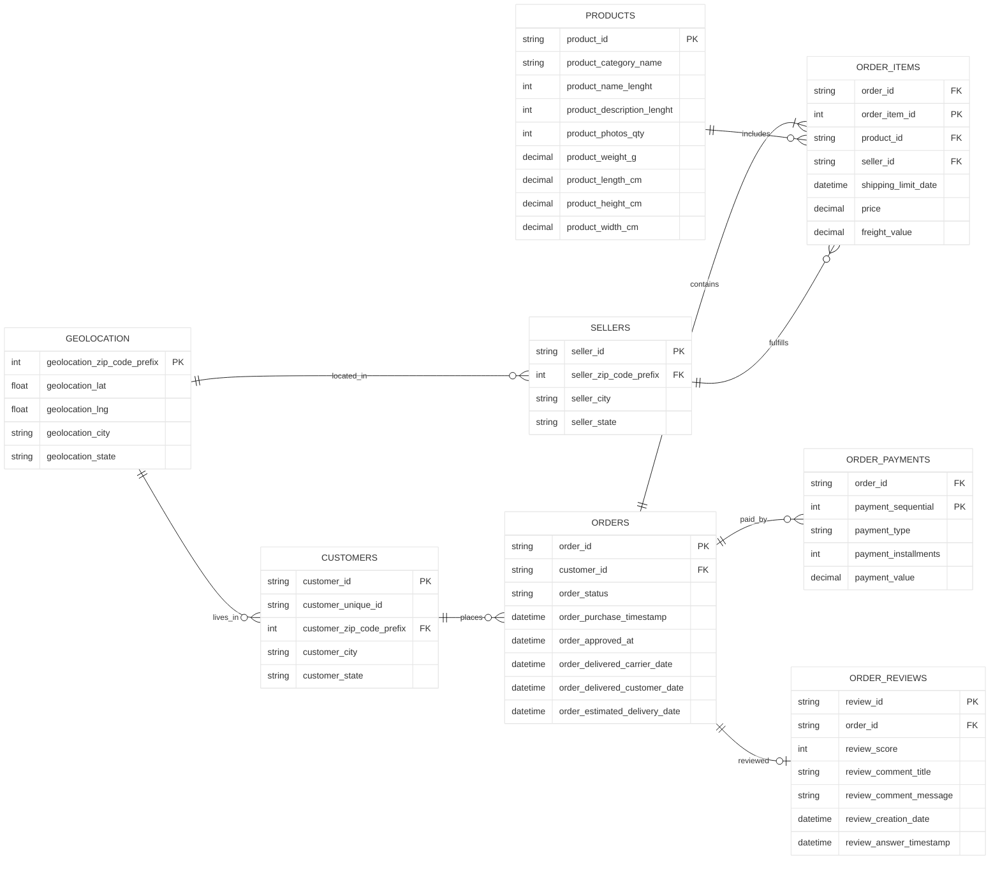
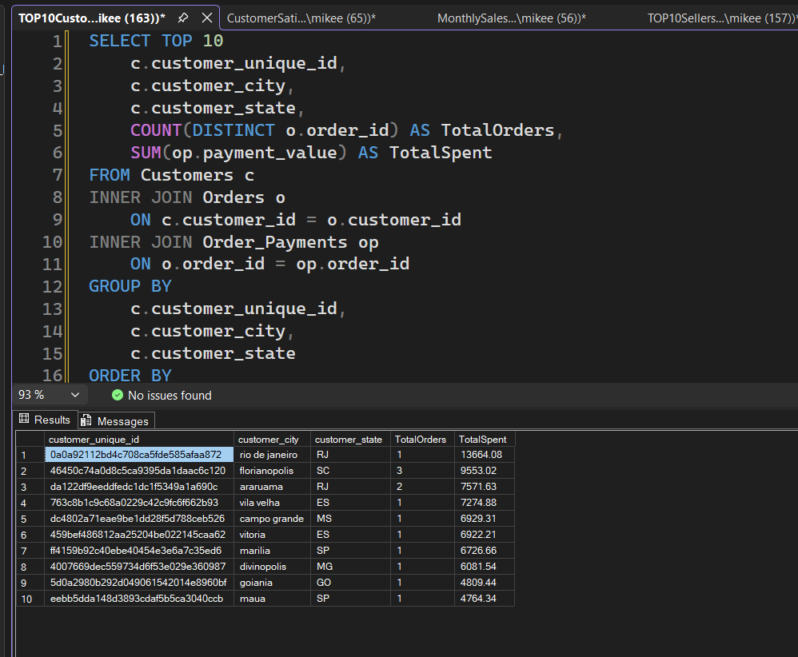
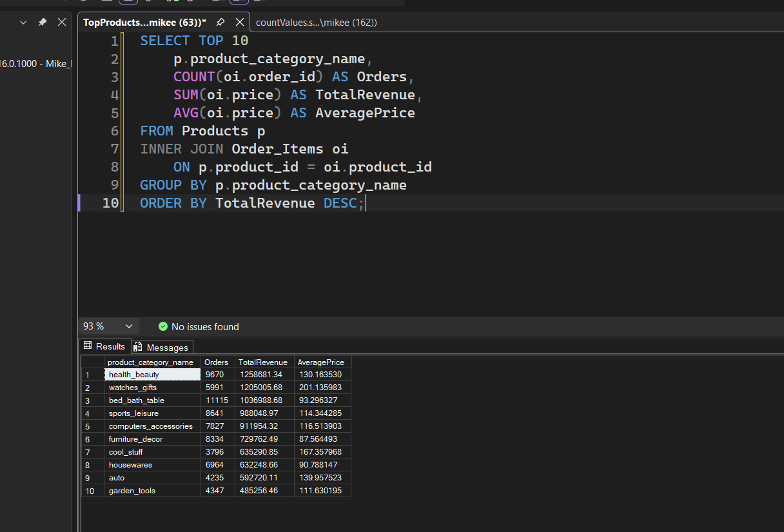
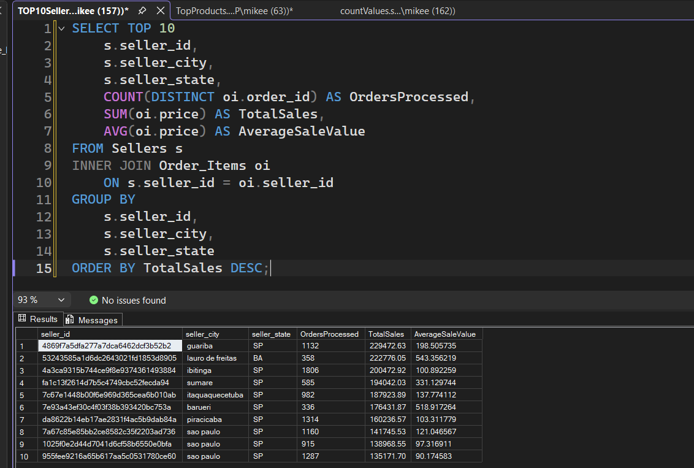
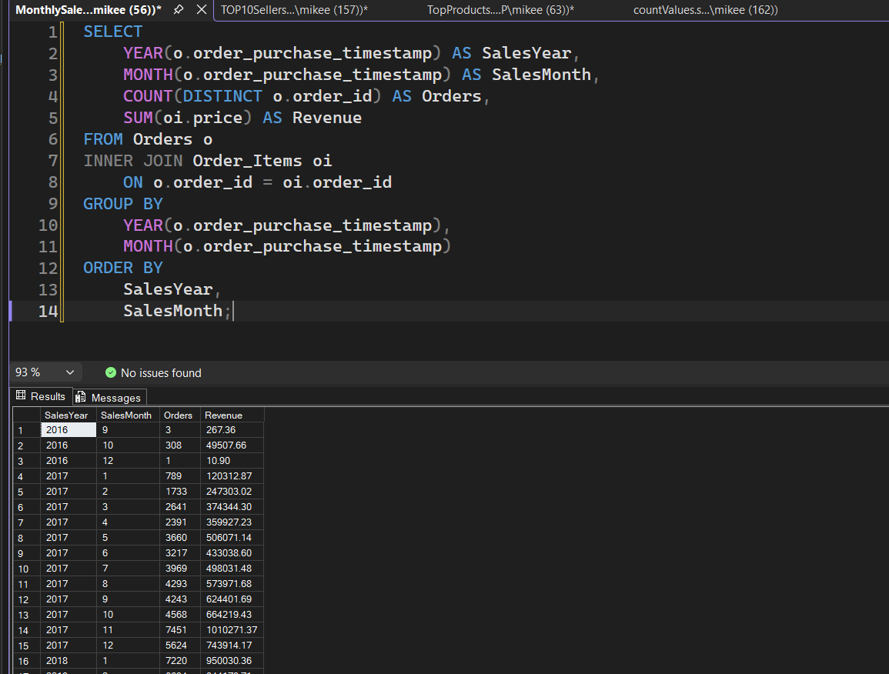
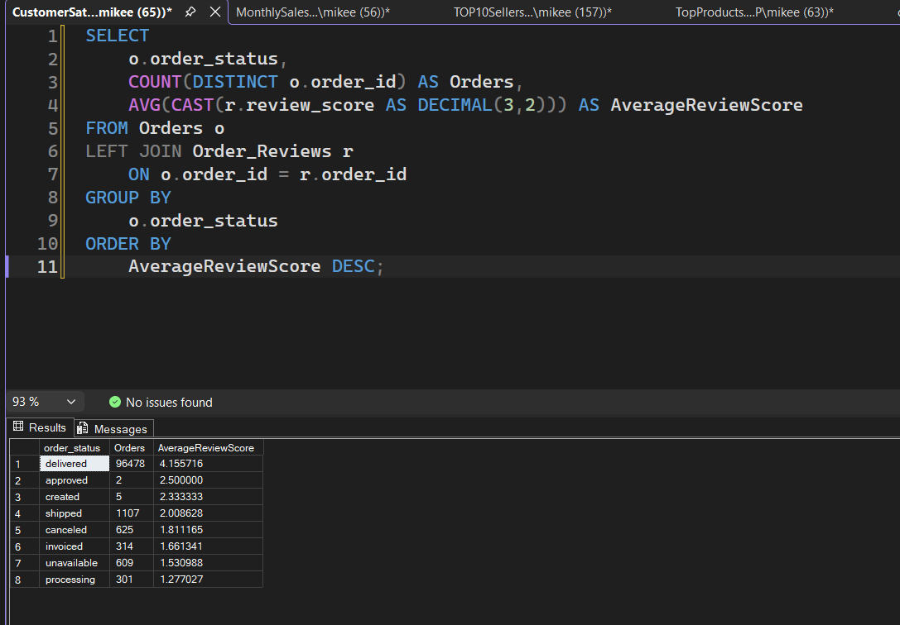

# Olist Data Engineering Project

<details>
<summary>Table of Contents</summary>

- [Project Overview](#project-overview)
- [Dataset](#dataset)
- [Schema & ERD](#schema--erd)
- [Technologies Used](#technologies-used)
- [Project Objectives](#project-objectives)
- [Database Design](#database-design)
- [Project Structure](#project-structure)
- [Data Cleaning](#data-cleaning)
- [SQL Features](#sql-features)
- [Example Analysis](#example-analysis)
- [Performance Optimisation](#performance-optimisation)
- [Future Improvements](#future-improvements)
- [Collaborators](#collaborators)
- [Acknowledgements](#acknowledgements)

</details>

## Project Overview

This project uses the Brazilian E-commerce Public Dataset by Olist to design, build and analyse a relational database using Microsoft SQL Server.

The objective is to demonstrate the complete data engineering workflow, including data exploration, cleaning, database design, SQL development, performance optimisation and analytical querying.

This project was completed as part of the Sparta Global Data Engineering programme.

---

## Dataset

Source:
https://www.kaggle.com/datasets/olistbr/brazilian-ecommerce

The dataset contains over 100,000 e-commerce orders placed between 2016 and 2018 in Brazil.

The project uses the following datasets:

- Customers
- Orders
- Order Items
- Products
- Sellers
- Payments
- Reviews
- Geolocation
- Product Category Translation

---

## SCHEMA & ERD

The database is structured around customers, orders, order items, products, sellers, payments, reviews, and geolocation data.


---

## Technologies Used

- Python
- Pandas
- Microsoft SQL Server
- SQL Server Management Studio (SSMS)
- Git
- GitHub
- VS Code

---

## Project Objectives

- Explore and understand the dataset
- Clean missing and inconsistent data
- Design a relational database
- Build tables using SQL
- Define Primary Keys and Foreign Keys
- Load CSV data into SQL Server
- Validate relationships
- Optimise query performance using indexes
- Perform business analysis using SQL

---

## Database Design

The relational database includes the following tables:

- Customers
- Orders
- Order Items
- Products
- Sellers
- Payments
- Reviews
- Geolocation
- Product Category Translation

Relationships are enforced using Primary Keys and Foreign Keys.

---

## Project Structure

```text
BrazilianECommerce/
├── Data/
│   ├── Cleaned/
│   │   ├── customers.csv
│   │   ├── geolocation.csv
│   │   ├── orders.csv
│   │   ├── order_items.csv
│   │   ├── order_payments.csv
│   │   ├── order_reviews.csv
│   │   ├── products.csv
│   │   └── sellers.csv
│   └── Raw/
│       ├── olist_customers_dataset.csv
│       ├── olist_geolocation_dataset.csv
│       ├── olist_orders_dataset.csv
│       ├── olist_order_items_dataset.csv
│       ├── olist_order_payments_dataset.csv
│       ├── olist_order_reviews_dataset.csv
│       ├── olist_products_dataset.csv
│       ├── olist_sellers_dataset.csv
│       └── product_category_name_translation.csv
├── Notebooks/
│   └── ETL.ipynb
├── Screenshots/
│   ├── CustomerSatisfaction.png
│   ├── MonthlySales.png
│   ├── Top10Customers.png
│   ├── Top10Products.png
│   └── Top10Sellers.png
├── SQL/
│   ├── CreationScript.sql
│   ├── deleteOlist.sql
│   └── OlistECommerce_Setup.sql
├── README.md
├── requirements.txt
├── SchemaERD.md
└── SQLScript.sql
```

---

## Data Cleaning

The data was explored and cleaned before loading into SQL Server.

Cleaning included:

- Checking for missing values
- Removing duplicates
- Validating primary keys
- Standardising column formats
- Ensuring referential integrity
- Converted Portuguese product categories to English

---

## SQL Features

The project demonstrates:

- CREATE DATABASE
- CREATE TABLE
- PRIMARY KEY
- FOREIGN KEY
- INSERT INTO
- INNER JOIN
- LEFT JOIN
- GROUP BY
- ORDER BY
- Aggregate Functions
- Indexes

---

## Example Analysis

Examples of business questions answered:

- Top customers by revenue
- Highest selling products
- Monthly sales trends
- Revenue by product category
- Average review scores
- Seller performance

### Example Outputs

***Top 10 Customers by Revenue***


***Top 10 Products by Revenue***


***Top 10 Sellers by Revenue***


***Monthly Sales Breakdown***


***Customer satisfaction by order status***



---

## Performance Optimisation

Indexes were added on frequently used columns including:

- customer_id
- order_id
- product_id
- seller_id

Query performance was compared before and after indexing.

---

## Future Improvements

- Build an automated ETL pipeline
- Load data directly into SQL Server using Python
- Create interactive Power BI dashboards
- Deploy the project using Azure or AWS
- Add data quality validation scripts

---

## Collaborators

**Alina Arus**

GitHub:
https://github.com/alina951

LinkedIn:
https://www.linkedin.com/in/alina-arus-6a18a0319/

**Mike Cooksley**

[Github](https://github.com/Mikeecee1)

[LinkedIn](https://www.linkedin.com/in/michael-cooksley/)


---

## Acknowledgements

Dataset provided by Olist and made available through Kaggle.

https://www.kaggle.com/datasets/olistbr/brazilian-ecommerce
