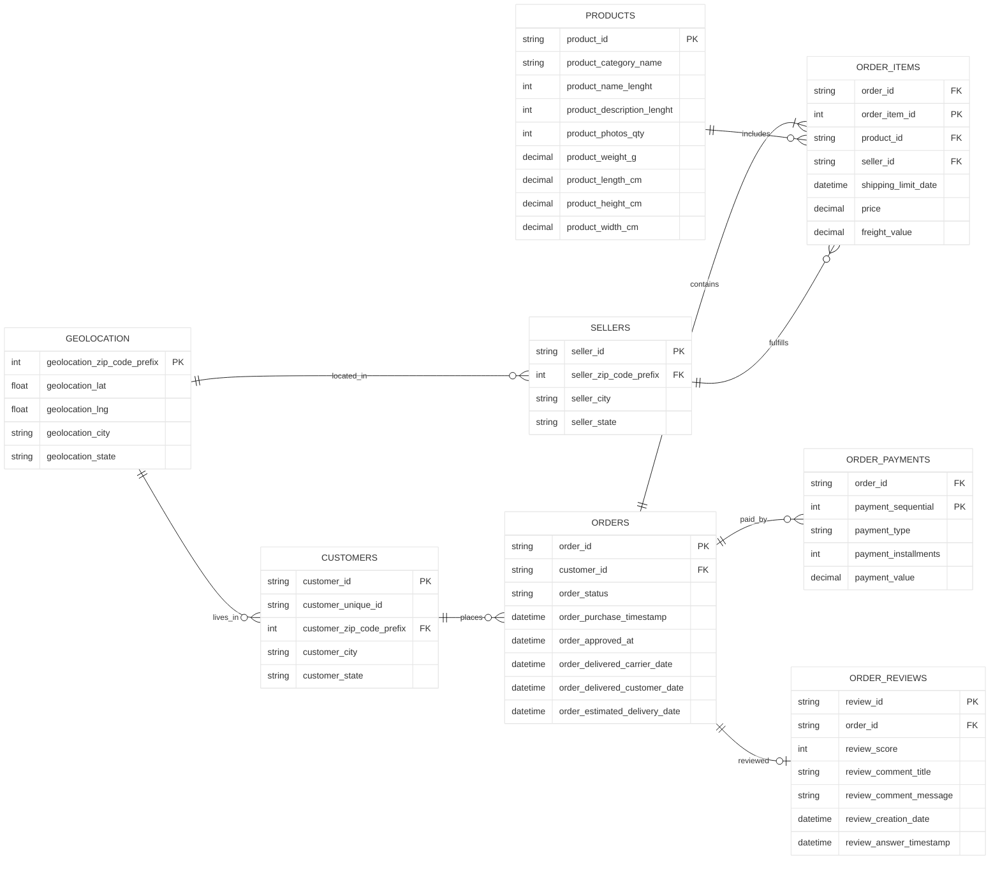

# Project ERD diagram and schema #

# Database Schema

## Tables

---

## customers

Stores customer information.

| Column | Type | Constraints | Description |
|---------|------|------------|-------------|
| customer_id | VARCHAR(50) | PK | Customer identifier |
| customer_unique_id | VARCHAR(50) | | Unique customer identifier |
| customer_zip_code_prefix | INT | FK → geolocation.geolocation_zip_code_prefix (logical) | ZIP code prefix |
| customer_city | VARCHAR(100) | | Customer city |
| customer_state | CHAR(2) | | Customer state |

---

## geolocation

Stores geographical information for ZIP code prefixes.

| Column | Type | Constraints | Description |
|---------|------|------------|-------------|
| geolocation_zip_code_prefix | INT | PK (logical) | ZIP code prefix |
| geolocation_lat | DECIMAL(10,8) | | Latitude |
| geolocation_lng | DECIMAL(11,8) | | Longitude |
| geolocation_city | VARCHAR(100) | | City |
| geolocation_state | CHAR(2) | | State |

---

## orders

Stores customer orders.

| Column | Type | Constraints | Description |
|---------|------|------------|-------------|
| order_id | VARCHAR(50) | PK | Order identifier |
| customer_id | VARCHAR(50) | FK → customers.customer_id | Customer |
| order_status | VARCHAR(30) | | Current order status |
| order_purchase_timestamp | TIMESTAMP | | Purchase date |
| order_approved_at | TIMESTAMP | | Approval date |
| order_delivered_carrier_date | TIMESTAMP | | Shipped date |
| order_delivered_customer_date | TIMESTAMP | | Delivered date |
| order_estimated_delivery_date | TIMESTAMP | | Estimated delivery |

---

## order_items

Stores the individual products purchased in each order.

| Column | Type | Constraints | Description |
|---------|------|------------|-------------|
| order_id | VARCHAR(50) | PK, FK → orders.order_id | Order |
| order_item_id | INT | PK | Item number |
| product_id | VARCHAR(50) | FK → products.product_id | Product |
| seller_id | VARCHAR(50) | FK → sellers.seller_id | Seller |
| shipping_limit_date | TIMESTAMP | | Shipping deadline |
| price | DECIMAL(10,2) | | Product price |
| freight_value | DECIMAL(10,2) | | Freight cost |

**Primary Key**

(order_id, order_item_id)

---

## order_payments

Stores payment information.

| Column | Type | Constraints | Description |
|---------|------|------------|-------------|
| order_id | VARCHAR(50) | PK, FK → orders.order_id | Order |
| payment_sequential | INT | PK | Payment sequence |
| payment_type | VARCHAR(30) | | Payment method |
| payment_installments | INT | | Number of installments |
| payment_value | DECIMAL(10,2) | | Payment amount |

**Primary Key**

(order_id, payment_sequential)

---

## order_reviews

Stores customer reviews.

| Column | Type | Constraints | Description |
|---------|------|------------|-------------|
| review_id | VARCHAR(50) | PK | Review identifier |
| order_id | VARCHAR(50) | FK → orders.order_id | Order |
| review_score | INT | | Rating (1–5) |
| review_comment_title | TEXT | | Review title |
| review_comment_message | TEXT | | Review comments |
| review_creation_date | TIMESTAMP | | Creation date |
| review_answer_timestamp | TIMESTAMP | | Response timestamp |

---

## products

Stores product catalogue information.

| Column | Type | Constraints | Description |
|---------|------|------------|-------------|
| product_id | VARCHAR(50) | PK | Product identifier |
| product_category_name | VARCHAR(100) | | Product category |
| product_name_lenght | INT | | Product name length |
| product_description_lenght | INT | | Description length |
| product_photos_qty | INT | | Number of photos |
| product_weight_g | DECIMAL(10,2) | | Weight (g) |
| product_length_cm | DECIMAL(10,2) | | Length |
| product_height_cm | DECIMAL(10,2) | | Height |
| product_width_cm | DECIMAL(10,2) | | Width |

---

## sellers

Stores seller information.

| Column | Type | Constraints | Description |
|---------|------|------------|-------------|
| seller_id | VARCHAR(50) | PK | Seller identifier |
| seller_zip_code_prefix | INT | FK → geolocation.geolocation_zip_code_prefix (logical) | ZIP code |
| seller_city | VARCHAR(100) | | Seller city |
| seller_state | CHAR(2) | | Seller state |

---

# Entity Relationship Diagram (ERD)

# Relationship Summary

| Parent | Child | Cardinality | Description |
|---------|-------|-------------|-------------|
| Geolocation | Customers | 1 : Many | A ZIP code can belong to many customers |
| Geolocation | Sellers | 1 : Many | A ZIP code can belong to many sellers |
| Customers | Orders | 1 : Many | A customer can place many orders |
| Orders | Order Items | 1 : Many | An order contains one or more items |
| Products | Order Items | 1 : Many | A product can appear in many order items |
| Sellers | Order Items | 1 : Many | A seller can sell many order items |
| Orders | Order Payments | 1 : Many | An order can have multiple payment records |
| Orders | Order Reviews | 1 : Zero or One | An order may receive a single review |

# Normalization

The schema conforms to **Third Normal Form (3NF)**:

- Customer, seller, product and location data are stored separately from transactions.
- Orders act as the transaction header.
- Order items represent line-item details.
- Payments and reviews are separated into independent entities.
- Foreign keys enforce referential integrity while minimizing data redundancy.